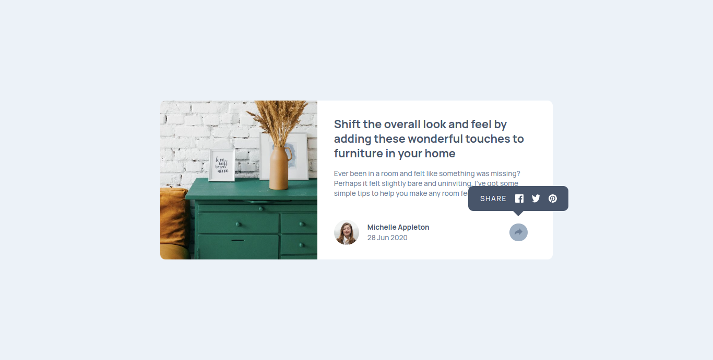
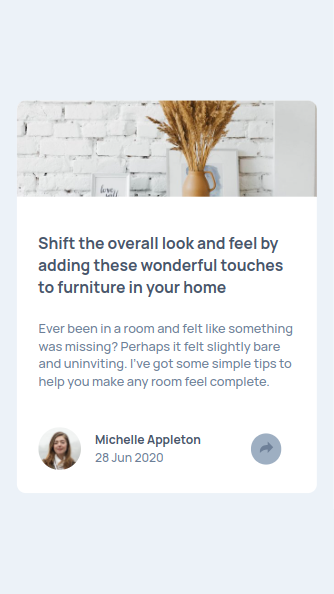

# Frontend Mentor - Article preview component solution

This is a solution to the [Article preview component challenge on Frontend Mentor](https://www.frontendmentor.io/challenges/article-preview-component-dYBN_pYFT). Frontend Mentor challenges help you improve your coding skills by building realistic projects.

## Table of contents

- [Overview](#overview)
  - [The challenge](#the-challenge)
  - [Screenshot](#screenshot)
  - [Links](#links)
- [My process](#my-process)
  - [Built with](#built-with)

## Overview

### The challenge

Users should be able to:

- View the optimal layout for the component depending on the device's screen size
- See the social media share links when they click the share icon

### Screenshot

### Links

- Solution URL: [GitHub Repo Link](https://github.com/aviralsharma07)
- Live Site URL: [Live Project Link](https://article-preview-component-avi.netlify.app/)

## My process

### Built with

- Semantic HTML5 markup
- CSS custom properties
- Flexbox

## Author

- Blogs - [Add your name here](https://hashnode.com/@aviralsharma)
- Frontend Mentor - [aviralsharma07](https://www.frontendmentor.io/profile/aviralsharma07)
- Twitter - [\_aviral07](https://www.twitter.com/_aviral07)
